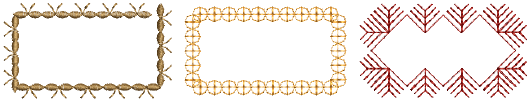
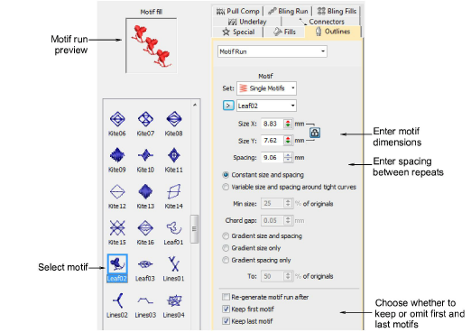
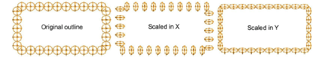
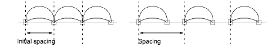
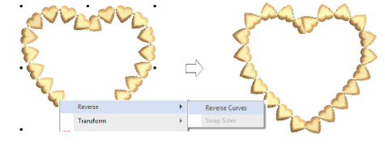
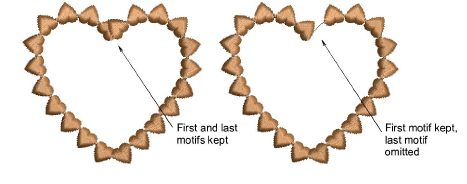

# Digitize motif runs

|  | Use Outline Stitch Types > Motif Run to create a string of motifs along a digitized line. |
| ---------------------------------------------- | ----------------------------------------------------------------------------------------- |
|        | Use Graphics Digitizing > Digitize Open Shape to digitize open shapes.                    |
|    | Use Graphics Digitizing > Digitize Closed Shape to digitize closed shapes.                |
|  | Use Outlines > Motif Run to place a row of motifs along a digitized line.                 |

Motif runs can be digitized as open or closed objects with graphical or traditional digitizing tools. Pretty much any digitizing tool can be used, including Freehand. Motif runs have some different properties to other decorative outline stitches. You can modify rotation angle, orientation and scale, and vary motif spacing.

## To digitize motif runs...

- Double-click or right-click the Motif Run icon to access object properties and select the motif you require.
- Select a motif set and the motif you want to use.

Tip: Select a motif with no object selected and click Apply to make the selection current. Use it with the Use Motif tool.

- Select a digitizing tool such as Digitize Open Shape or Digitize Closed Shape to create a string of motifs along a digitized line:
- To use default size and orientation, press Enter.
- Use the Size fields to adjust motif dimensions. The scaling lock maintains aspect ratio.

- Use the Spacing field to control repeat distance.

- Optionally, use the Reverse Curves command in the popup menu to change motif orientation.

- Choose whether to keep or omit first and last motifs to avoid overlaps.

- Press Enter or click Apply.
