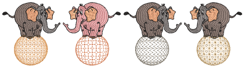

# Enveloped motif fills

EmbroideryStudio provides techniques for ‘sculpting’ motif fills to create three dimensional effects. Create graded columns of motif stitching. Or make motif fills appear concave or convex. You can also create perspective effects.

Tip: Small stitches may be generated along the edge of objects employing these effects. You can remove these automatically. [See Eliminating small stitches for details.](../../Quality/quality/Eliminating_small_stitches)

## Related topics...

- [Create graded motif columns](Create_graded_motif_columns)
- [Create convex & concave effects](Create_convex_concave_effects)
- [Create perspective effects](Create_perspective_effects)
