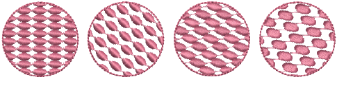
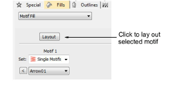
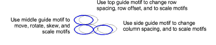
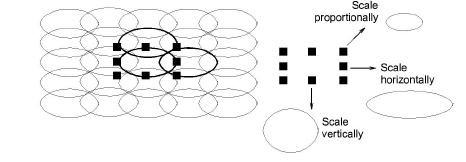
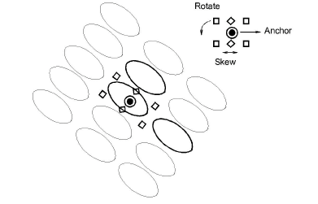
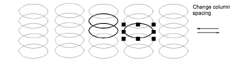
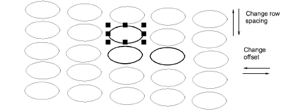

# Lay out motif fills on-screen

|  | Use Fill Stitch Types > Motif Fill to create decorative fills using embroidery motifs to form repeating patterns. Right-click for settings. |
| ------------------------------------------------ | ------------------------------------------------------------------------------------------------------------------------------------------- |

Lay out motif fills on-screen in a similar way to [program splits](../../glossary/glossary) by using ‘guide motifs’ to scale, space, transform and offset the entire fill. There are three blue guide motifs. Each guide motif lets you change a different element of the layout. [Stitch angle](../../glossary/glossary) has no effect on motif layouts.

Generally you define a layout before digitizing. If it is important to align motifs with the object boundary, digitize the object using current settings, and change the layout afterwards.

## To lay out motif fills on-screen...

1. Right-click the Motif Fill icon to access object properties.

2. Select a motif set and motif and click Layout. Sample and guide motifs appear in the design window. Zoom in to select the correct guide motif.

3. Adjust the guide motifs to achieve the effect you require:

- Move motifs by selecting the middle guide motif and dragging it to a new position.
- Scale motifs by selecting a guide motif and resizing it using the [selection handles](../../glossary/glossary).

- Rotate motifs by clicking the middle guide twice to display the rotation handles. Click a corner handle and drag to rotate.
- Skew motifs by clicking the middle guide twice, then dragging the skew handles.

- Change column spacing by selecting the side guide and dragging it left or right.

- Change row spacing by selecting the top guide and dragging it up or down.
- Change row offset by selecting the top guide and dragging it left or right.

Note: Motif Fill does not have a column offset since motifs are connected along each row. Instead you can rotate the layout to achieve a similar effect.

4. Press Esc to finish. The size and layout settings you select become current settings.

Tip: To revert to the original factory settings, run the Revert utility. Alternatively, enter the values manually in the Object Properties > Fills > Motif Fill and click Save.

## Related topics...

- [Lay out program splits on-screen](../patterns/Lay_out_program_splits_on-screen)
