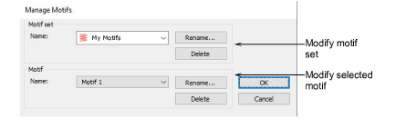

# Manage custom motifs

Manage your custom motif sets via the Manage Motifs command.

## To manage custom motifs...

- Select the Setup > Manage Motifs command. The dialog opens.

- Select the motif set you want to modify from the droplist.
- Select a motif from the Motif group.
- Use the Rename and Delete buttons to modify as required.
