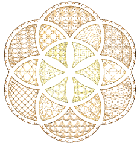

# Motif Stitching

Motifs are predefined design elements, such as hearts, leaves or border patterns. They generally consist of one or more simple objects, and are stored in special motif sets.

Motifs can be used for ornamental outlines and patterned fills or even on their own. Motifs can be scaled, rotated and mirrored in the same way as other objects. You can even use them to create interesting three dimensional effects.

Whether using them in runs, fills, or individually, motifs can be selected from predefined motif sets. Other ornament types can be used as motifs. You can even define your own, including motifs derived from cross stitching.

## Related topics...

- [Selecting & placing motifs](Selecting_placing_motifs)
- [Motif runs](Motif_runs)
- [Motif fills](Motif_fills)
- [Enveloped motif fills](Enveloped_motif_fills)
- [Custom motifs](Custom_motifs)
