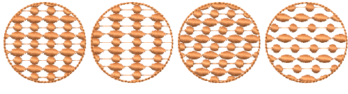
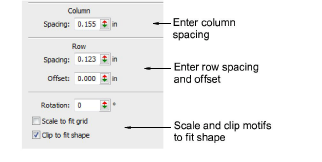
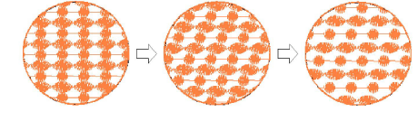
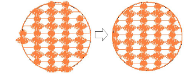
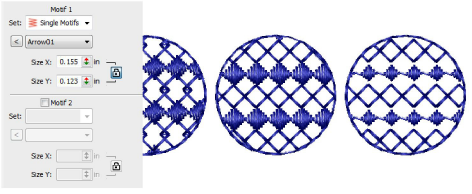
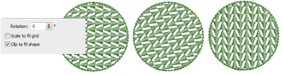

# Motif fill settings

|  | Use Fill Stitch Types > Motif Fill to create decorative fills using embroidery motifs to form repeating patterns. Right-click for settings. |
| ------------------------------------------------ | ------------------------------------------------------------------------------------------------------------------------------------------- |

You can adjust motif fills both interactively on screen and via object properties.

## Spacing & offsets

You can adjust the exact row, column and spacing settings for motif fills. The [default settings](../../glossary/glossary) define a simple grid where the spacing equals the motif dimensions. The row offset is set to 0.00 mm so columns and rows are perpendicular.

- To adjust spacing and offset settings, open the Object Properties > Fills > Motif Fill dialog.

- Adjust column and row spacing as well as row offsets.

- Select the Scale to fit grid checkbox to scale motifs to exactly fit the grid squares.
- Select the Clip to fit shape checkbox to clip motifs that do not fit the shape.

## Motif scaling

You can set the exact size of motifs in a fill. You can also scale Motif 1 and Motif 2 motifs independently. Adjust Size controls in the Object Properties > Fills > Motif Fill dialog.

## Motif rotation

The rotation angle defines the orientation of the entire motif fill pattern. It overrides the [stitch angle](../../glossary/glossary) you set when digitizing the shape with Complex Fill. Enter a rotation angle in the Object Properties docker.

