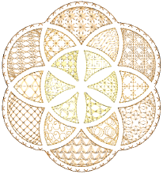

# Motif fills

Motif Fill is a decorative stitch used for filling closed objects. This feature repeats motifs in parallel rows to fill the shape. It is generally used for open stitching and special effects. Alternatively, it can be layered over top of solid stitching backgrounds. You can select different motifs for forward and backward rows. You can create motif layouts onscreen or via object properties. Auto Underlay is deactivated with motif fills and [stitch angle](../../glossary/glossary) has no effect.

## Related topics...

- [Digitize motif fills](Digitize_motif_fills)
- [Motif fill settings](Motif_fill_settings)
- [Lay out motif fills on-screen](Lay_out_motif_fills_on-screen)
