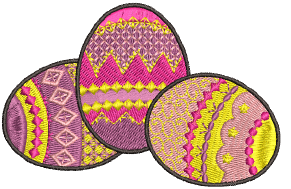

# Motif runs

Motif Run is a stitch type that forms repeated motifs along a digitized line. It is typically used for decorative borders or special effects.

## Related topics...

- [Digitize motif runs](Digitize_motif_runs)
- [Reshape motif runs](Reshape_motif_runs)
