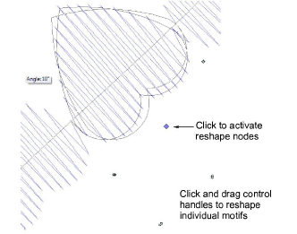

# Reshape motif runs

|  | Use Reshape > Reshape Object to reshape selected motif run objects. |
| ---------------------------------------------- | ------------------------------------------------------------------- |

Motif runs can be reshaped like other embroidery object, but special control points are provided.

## To reshape a motif run...

- Select a motif run object and click the Reshape Object icon. Control points appear around the motifs.

- Adjust object size like any other object using sizing handles.

- Click the diamond control point of a motif to activate reshape nodes. Use these to fine-tune individual motifs. Each one can be rotated, skewed, or resized respectively.

::: info Note
A ‘Regenerate motif run’ checkbox forces the system to regenerate motif runs based on current settings whenever an object is scaled or skewed. When left unchecked, the system will not re-generate and the number of motifs will remain unchanged after the transformation.
:::

- Press Esc to finish.

## Related topics...

- [Reshaping Objects](../../Modifying/reshape/Reshaping_Objects)
