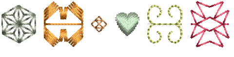
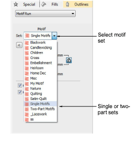
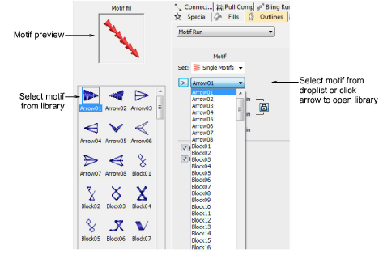
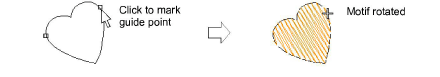
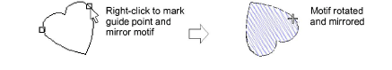
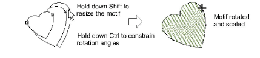
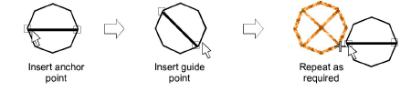
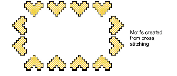

# Selecting & placing motifs

|    | Use Outline Stitch Types > Motif Run to create a string of motifs along a digitized line.                                                   |
| -------------------------------------- | ------------------------------------------------------------------------------------------------------------------------------------------- |
|  | Use Fill Stitch Types > Motif Fill to create decorative fills using embroidery motifs to form repeating patterns. Right-click for settings. |
|    | Use Traditional Digitizing > Use Motif to add motifs to design one-by-one. Rotate, scale, or mirror as you add.                             |

You select motifs for use in runs, fills, or individually, via the Object Properties docker.

Motifs are commonly used in decorative outlines or open fills. However, you can add them to your design one-by-one. Rotate, scale, or mirror them as you add or edit them like any other object.

## To select a motif...

- Right-click the Motif Run icon to access object properties.

- Select a motif set from the droplist. There are two sets specific to motifs – single or two-part. However, you can use any other available set.
- Select a pattern from the droplist. Alternatively, click the arrow button to access the motif library.

- Select Use Motif. A motif outline appears attached to the mouse pointer.
- Click to mark an anchor point.

- Drag the mouse to rotate, scale, or mirror:
- To rotate, move the pointer then click again.

- To mirror the motif, right-click.

- To scale the motif, press Shift, move the pointer, then click again.

- Repeat as required. Stitches are generated automatically.

- Alternatively, press Enter to accept default position and settings.
- Press Esc to finish.

Tip: You can create motifs from patterns made in ES Cross Stitch and use them to create a cross stitch sampler. See Cross Stitch Supplement for details.

## Related topics...

- [Motif runs](Motif_runs)
- [Motif fills](Motif_fills)
