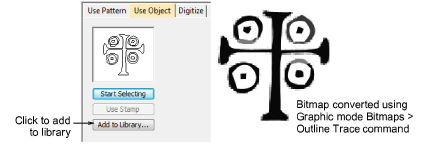
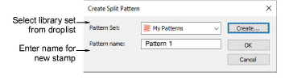
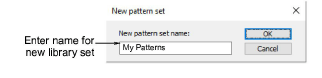
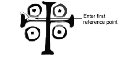
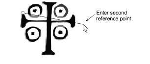

# Add stamps to a library

|  | Use Docker > Carving Stamp to define a pattern of needle penetrations using a ‘carving stamp’ as a template. |
| ------------------------------------------------------ | ------------------------------------------------------------------------------------------------------------ |

This procedure starts when you click the enabled Add to Library button either on the Use Object tab or Digitize tab in the Carving Stamp docker.

Tip: The Carving Stamp feature can only use vector or embroidery objects as a basis for stamps. If you want to use a bitmap image, you can convert to vector format in CorelDRAW Graphics using the Bitmaps > Outline Trace command set.

## To add a stamp to a library...

1Select an object which you want to add to the library as a custom stamp.

- Digitize carving stamps on the spot using the Carving Stamp > Digitize tab.
- Define carving stamps using the Carving Stamp > Use Object tab.

2On either of these tabs, click the enabled Add to Library button. The Create Split Pattern dialog opens.

3Select a set from the droplist or click the Create button to create a new library.

If you chose to create a new library set, use the New Pattern Set dialog to create a new stamp set. The newly created stamp set is displayed in the Set list when the Use Pattern tab is selected.

4Enter a new stamp name and click OK. You are prompted to digitize the first reference point in the design window.

5Enter the first reference point:

- Press Enter to have the reference point created automatically.
- Move the mouse pointer to the position you want to use as the anchor point during manual stamp placement, and left-click.

6Enter the second reference point:

- Press Enter to have the reference point created automatically.
- Move the mouse pointer to the position you want to use as the guide point during manual stamp placement and left-click.

7Click OK. The newly created stamp is displayed in the stamp list when the Use Pattern tab is selected.

Note: The Rename and Delete buttons are enabled in the Use Patterns tab whenever a custom stamp is selected.

## Related topics...

- [Digitize custom splits](Digitize_custom_splits)
- [Use objects as carving stamps](Use_objects_as_carving_stamps)
- [Apply predefined patterns](Apply_predefined_patterns)
