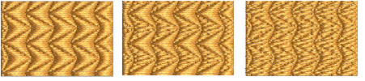
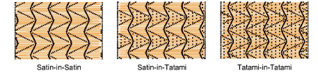

# Apply combination splits

|  | Use Fill Stitch Types > Program Split to create decorative fill stitches where needle penetrations form a tiled pattern.                                  |
| ------------------------------------------------------ | --------------------------------------------------------------------------------------------------------------------------------------------------------- |
|  | Use Outline Stitch Types > Program Split to create borders or columns of even width for decorative needle penetration patterns. Right-click for settings. |

Standard program split consists of a satin foreground and background – i.e. Satin-in-Satin. If patterns do not overlap you may get jump stitches or gaps occurring in the background. In this case, you can select from different combinations of satin and tatami stitches.

## To apply combination splits...

1Right-click the Program Split icon to access object properties.

2In the Combination Split panel, click the desired option:

Options include:

| Option           | Function                                                                                                             |
| ---------------- | -------------------------------------------------------------------------------------------------------------------- |
| Satin-in-Satin   | This is the standard program split stitch type, which produces the smallest number of stitches.                      |
| Satin-in-Tatami  | Use this option to avoid long stitches when the patterns are small but column and row spacings are wide.             |
| Tatami-in-Tatami | Both foreground and background use tatami. Select this option for large objects and patterns to avoid long stitches. |
