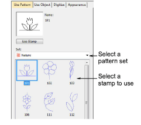
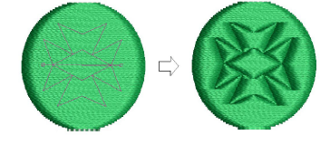
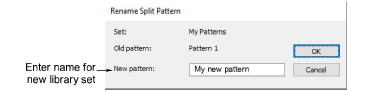

# Apply predefined patterns

|  | Use Docker > Carving Stamp to define a pattern of needle penetrations using a ‘carving stamp’ as a template. |
| -------------------------------------------- | ------------------------------------------------------------------------------------------------------------ |

The Use Pattern tab lets you select and apply predefined stamp patterns. You can start with or without embroidery objects selected. If one or more objects is selected, stamps are only applied to selected objects. If no object is pre-selected, stamps can be applied to any objects.

## To apply predefined patterns...

1. Select an [embroidery object](../../glossary/glossary) or not as required.

2. Click the Carving Stamp icon. The Use Pattern tab is open by default.

3. Select a pattern set from the Set list. The droplist contains predefined pattern sets as well as custom sets. Many are shared with other features such as Monogramming.

4. Select a predefined stamp pattern. A thumbnail appears in the preview panel and the Use Stamp button is enabled.

5. Click the Use Stamp button and move the mouse pointer to the design window.

6. Move the mouse pointer to the desired position over the target object/s.

- Right-click to mirror the stamp.
- Press Shift to prevent Auto Scroll.

7. Click the mouse button to fix the anchor point.

8. Swivel the pattern about the anchor point to the desired guide point position.

9. Optionally, with the Shift key pressed, resize the stamp while moving the mouse pointer.

10. Click the mouse button.

- If you have pre-selected an object or objects, the stamp pattern is applied only to those objects.
- If no objects are pre-selected, the stamp pattern is applied to any underlying objects.

11. Press Esc to exit the feature.

Note: The Rename and Delete buttons are enabled whenever a custom stamp is selected. When the Rename button is clicked, the Rename Split Pattern dialog opens.

Tip: Use the Softened Stamp and Raised Stamp options on the Appearance tab to soften or accentuate the effect.

## Related topics...

- [Add stamps to a library](Add_stamps_to_a_library)
- [Carving stamp appearance](Carving_stamp_appearance)
