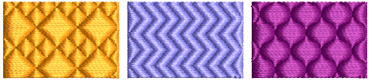
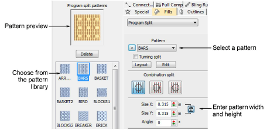
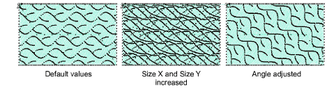

# Apply program splits

|            | Use Fill Stitch Types > Program Split to create decorative fill stitches where needle penetrations form a tiled pattern. Right-click for settings.        |
| ------------------------------------------------------ | --------------------------------------------------------------------------------------------------------------------------------------------------------- |
|  | Use Outline Stitch Types > Program Split to create borders or columns of even width for decorative needle penetration patterns. Right-click for settings. |

You can apply Program Split to a wide variety of objects. You can adjust these either before or after applying the effect. Choose from a library of split patterns.

Note: Digitize the [stitch angle](../../glossary/glossary) carefully when creating objects with program splits. If rows are parallel with pattern lines, they will rarely intersect and the pattern may not be visible. A 45° stitch angle is suitable for most patterns.

## To apply program splits...

- Click the Program Split icon. Program Split stitching is applied to new or selected objects, based on current settings.
- Right-click the Program Split icon to access object properties.
- Select a pattern from the droplist. Alternatively, click the arrow button to access the pattern library.

- Adjust pattern size via Size X/Y fields. The scaling lock maintains aspect ratio. Use the Angle setting to orientate the pattern within the shape.

Tip: Tatami patterns can be combined with curved fills for interesting effects.

## Related topics...

- [Curved fills](../curves/Curved_fills)
