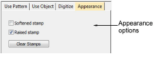
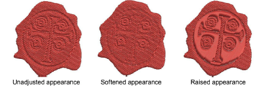

# Carving stamp appearance

|  | Use Docker > Carving Stamp to define a pattern of needle penetrations using a ‘carving stamp’ as a template. |
| ------------------------------------------------------ | ------------------------------------------------------------------------------------------------------------ |

The Appearance tab of the Carving Stamp docker provides settings which can help to soften or intensify the effect.

- Checking the Softened Stamp checkbox causes any existing stamp/s to be softened.

- Checking the Raised Stamp checkbox cause any splits within the combined closed boundaries of a carving stamp to be removed.

::: info Note
Clicking the Clear All Stamps button will cause all existing stamps to be removed from selected objects.
:::
