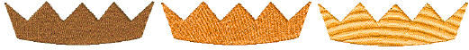
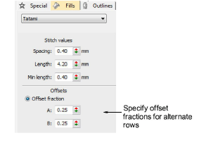
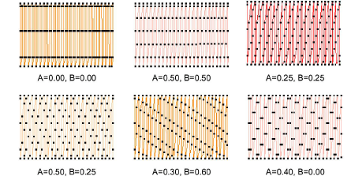
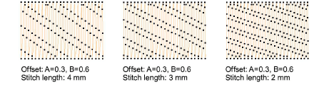
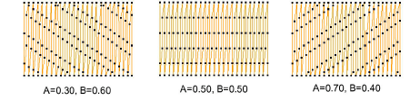

# Create offset patterns

|  | Use Fill Stitch Types > Tatami to create fills for larger irregular shapes. Right-click for settings. |
| ---------------------------------------- | ----------------------------------------------------------------------------------------------------- |

The tatami offset [default settings](../../glossary/glossary) are designed to create a uniformly flat and smooth surface. The texture is like a woven tatami mat without obvious split lines. By manipulating offset fractions, you can create stitch penetrations which are more clearly visible.

Tip: By adjusting offsets, you can also improve the quality of turning tatami where the pattern may be disturbed by non-parallel stitches. Changing the offsets can reduce this interference.

## To create offset patterns...

1. Right-click the Tatami icon to access object properties.

2. Select the Offset Fraction option. To control needle penetrations you set offset fractions for both forward and backward rows.

3. In A and B fields, experiment with offset fraction values. Offsets are defined as fractions of stitch length – e.g. 0.3 = 30%.

- Even stitching: set both fields to 0.25.
- Strong horizontal lines: set both fields to 0.00 or 1.00\. The distance between each line of needle penetrations is the stitch length.
- Light horizontal lines: set both fields to 0.5\. Lines are produced at half stitch-length intervals.

- Diagonal lines: set both fields to any value other than 0.00, 0.50 and 1.00. Diagonal lines are less noticeable than horizontal or vertical lines. Vary both values to change the angle of the lines and the distance between them.
- Other: set one field to 0.00, and experiment with the other values to place the needle penetrations on the forward and backward rows close to each other, but with different effects.

Note: If A-B offsets add up to 1.0, lines will be horizontal. If the sum is less than 1.0, lines will slope down, more and they slope up. The mirror image of ‘A=0.3 and B=0.6’ is ‘A=0.7 and B=0.4’.

Tip: Tatami patterns can be combined with curved fills for interesting effects.

## Related topics...

- [Curved fills](../curves/Curved_fills)
