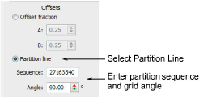
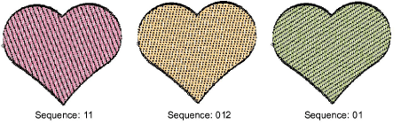
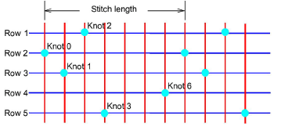
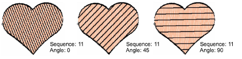

# Create partition line patterns

|  | Use Fill Stitch Types > Tatami to create fills for larger irregular shapes. Right-click for settings. |
| -------------------------------------------------- | ----------------------------------------------------------------------------------------------------- |

The Partition Line feature provides an alternative method for offsetting needle penetrations in tatami fills. The Object Properties > Fills > Tatami docker allows you to set partition lines. Two parameters can be set – Sequence and Angle.

## Sequence

Partition Line allows you to specify up to eight tatami offsets. In any pattern, number of rows is determined by number of digits in the sequence.

Each stitch length is split into ‘knots’ numbered anywhere from 0 to 7\. A partition sequence number of ‘20163’ would translate to the following pattern:

## Angle

You can skew the grid formed by the partition knots to further vary the needle penetrations. In the Angle field, specify a grid angle.

::: tip
Tatami patterns can be combined with curved fills for interesting effects.
:::

## Related topics...

- [Curved fills](../curves/Curved_fills)
