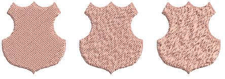

# Create random patterns

|  | Use Fill Stitch Types > Tatami to create fills for larger irregular shapes. Right-click for settings. |
| -------------------------------------------------- | ----------------------------------------------------------------------------------------------------- |

Using a random factor you can eliminate the split line patterns formed by regular needle penetrations and distribute the stitches randomly inside the shape. This can create interesting mottled effects.

## To create random patterns...

- Right-click the Tatami icon to access object properties.

- In the Random field, specify a random factor between 0% and 100%.

Tip: A value of around 50% generally gives good results.
