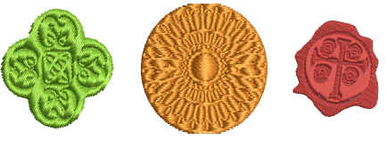
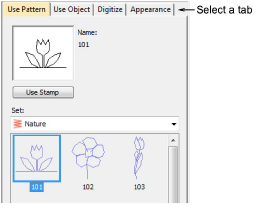

# Creating patterns with carving stamps

The Carving Stamp feature allows you to define a pattern of needle penetrations using a ‘carving stamp’ as a template. A carving stamp can be any [vector](../../glossary/glossary) or embroidery shape.

## Carving Stamp docker

The Carving Stamp docker contains four tabs as shown...

These tabs provide the following functionality:

| Tab         | Lets you...                                                                    |
| ----------- | ------------------------------------------------------------------------------ |
| Use Pattern | Select and apply predefined stamp patterns to selected objects.                |
| Use Object  | Use selected outlines as a temporary stamp. These can include vector graphics. |
| Digitize    | Digitize custom splits ‘on the fly’.                                           |
| Appearance  | Soften or intensify the effect.                                                |

## Related topics...

- [Apply predefined patterns](Apply_predefined_patterns)
- [Use objects as carving stamps](Use_objects_as_carving_stamps)
- [Digitize custom splits](Digitize_custom_splits)
- [Carving stamp appearance](Carving_stamp_appearance)
- [Reshape carving stamps](Reshape_carving_stamps)
- [Add stamps to a library](Add_stamps_to_a_library)
