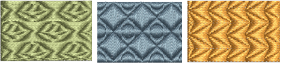

# Creating patterns with custom splits

Make your own patterns to use in Program Split fills. The same patterns can also be used with Flexi Split effects.

## Related topics...

- [Make split patterns](Make_split_patterns)
- [Edit split patterns](Edit_split_patterns)
