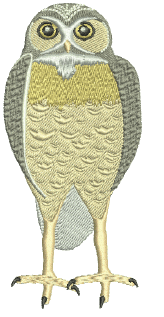

# Creating textures with program splits

Program Split is a decorative fill stitch where needle penetrations form a tiled pattern. Select a predefined pattern or create your own.

## Related topics...

- [Apply program splits](Apply_program_splits)
- [Apply combination splits](Apply_combination_splits)
- [Program split settings](Program_split_settings)
- [Lay out program splits on-screen](Lay_out_program_splits_on-screen)
