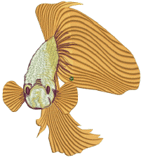
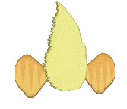
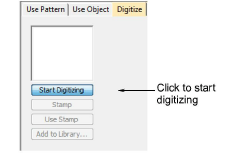
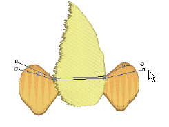
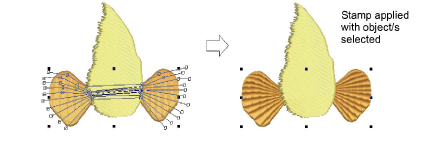
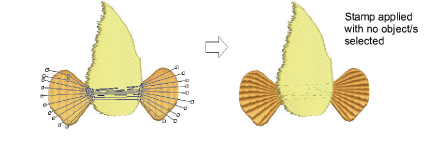
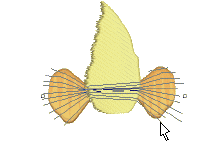

# Digitize custom splits

|  | Use Docker > Carving Stamp to define a pattern of needle penetrations using a ‘carving stamp’ as a template. |
| ------------------------------------------------------ | ------------------------------------------------------------------------------------------------------------ |

The Digitize tab allows you to digitize split lines and directly apply in situ or to any applicable objects in the design window.

## To digitize custom splits...

1. Select an embroidery object or not as required. If embroidery objects are pre-selected, digitized stamps will apply only to these objects.

2. Click the Carving Stamp icon and select the Digitize tab of the dialog.

3. Click the Start Digitizing button. You are prompted to enter a starting point for the stamp outline.

4. Digitize split lines:

- Press Enter once to complete a boundary.
- Press Enter again to finish stamp digitizing.

5. Click the enabled Stamp button.

- Click the Stamp button to apply the stamp to selected applicable objects only.

- Alternatively, use Stamp to apply the stamp to applicable objects with no object/s selected. Every object beneath the stamp is affected.

- Click the Use Stamp button to position the stamp. You are prompted to enter an anchor point as with predefined patterns.

6. Optionally, click the Add to Library button to add the selection to the library for future reference.

## Related topics...

- [Apply predefined patterns](Apply_predefined_patterns)
- [Add stamps to a library](Add_stamps_to_a_library)
