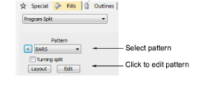
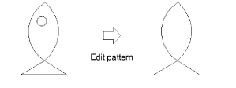
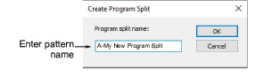

# Edit split patterns

Editing a pattern changes the actual pattern, not just the object layout.

## To edit a split pattern...

1. Right-click the Program Split icon to access object properties.

2. Select a pattern and click Edit.

3. Press Shift+0 to zoom in on the pattern.

4. Scale, transform or reshape the pattern as required.

5. Select Object > Create Program Split with the pattern selected.

6. Enter a name for the pattern in the Create Program Split dialog.

- To create a pattern based on the old one, enter a new name.
- To overwrite the original pattern, enter the name of the original.

7. Click OK. The pattern is automatically selected in the Pattern list.

## Related topics...

- [Creating textures with program splits](Creating_textures_with_program_splits)
- [Flexi-splits](../curves/Flexi-splits)
