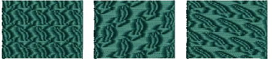
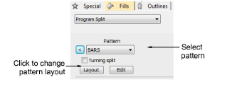
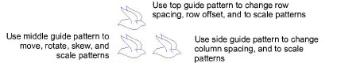
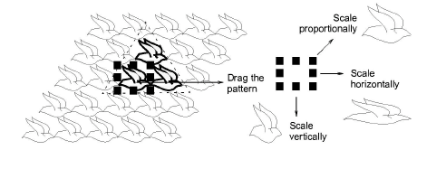
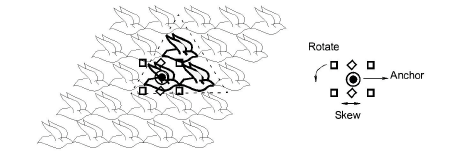
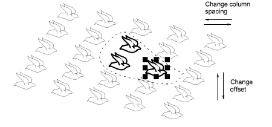
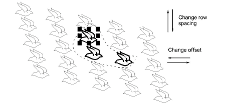

# Lay out program splits on-screen

|  | Use Fill Stitch Types > Program Split to create decorative fill stitches where needle penetrations form a tiled pattern.                                  |
| ------------------------------------------------------ | --------------------------------------------------------------------------------------------------------------------------------------------------------- |
|  | Use Outline Stitch Types > Program Split to create borders or columns of even width for decorative needle penetration patterns. Right-click for settings. |

You lay out program splits on-screen in a similar way to [Motif Fills](../../glossary/glossary) by using ‘guide patterns’ to scale, space, transform and offset the entire pattern fill.

## To lay out program splits on-screen...

1. Right-click the Program Split icon to access object properties.

2. Select a pattern from the droplist. Alternatively, click the arrow button to access the pattern library.

3. Click Layout. Three blue guide patterns allow you to change the layout.

4. Adjust the guide patterns to achieve the desired effect:

- Move patterns by selecting the middle guide pattern and dragging.
- Scale patterns by selecting a guide pattern and dragging selection handles.

- Rotate patterns by clicking the middle guide twice to display the rotation handles. Click a corner handle and drag to rotate.
- Skew patterns by clicking the middle guide twice, then dragging the skew handles.

- Change column spacing by selecting the side guide and dragging it left or right.
- Change column offset by selecting the side guide and dragging it up or down.

- Change row spacing and offsets in the same way as columns.

5. Press Enter to apply.

## Related topics...

- [Lay out motif fills on-screen](../motifs/Lay_out_motif_fills_on-screen)
