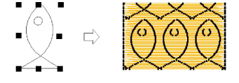
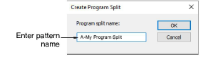

# Make split patterns

Make your own patterns to use in program split fills. Create patterns from the outlines of embroidery objects or from [drawing objects](../../glossary/glossary). Patterns you create can also be used for Flexi Split effects.

## To make a split pattern...

1. Select the object (or objects) you want to use for the pattern.

2. Select Object > Create Program Split.

3. Enter a name in the Create Program Split dialog.

4. Click OK. The new pattern is automatically selected in the Pattern list.

## Related topics...

- [Creating textures with program splits](Creating_textures_with_program_splits)
- [Flexi-splits](../curves/Flexi-splits)
