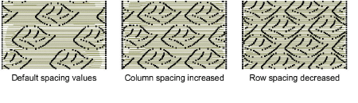
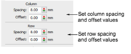
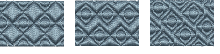
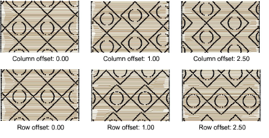
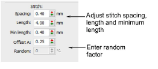
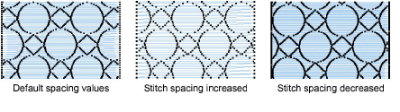
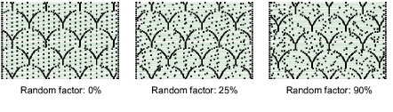
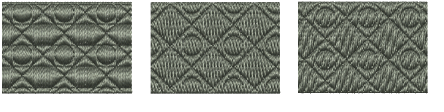
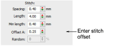
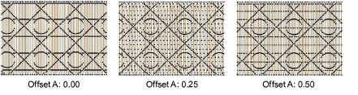

# Program split settings

|  | Use Fill Stitch Types > Program Split to create decorative fill stitches where needle penetrations form a tiled pattern.                                  |
| ------------------------------------------------------ | --------------------------------------------------------------------------------------------------------------------------------------------------------- |
|  | Use Outline Stitch Types > Program Split to create borders or columns of even width for decorative needle penetration patterns. Right-click for settings. |

You can adjust program splits both interactively on screen and via object properties.

## Column & row spacing

Column and row spacing settings determine distance between grid lines. Patterns are placed at intersection points – the center of each pattern coincides with an intersection.

The initial settings define a simple grid, where the spacing equals the dimensions of the pattern. The row offset is set to 0.00 mm so columns and rows are perpendicular.

## Column & row offsets

With all three program split combinations – Satin-in-Satin, Satin-in-Tatami and Tatami-in-Tatami – you can vary the pattern by applying offset settings to rows and/or columns. You can also provide background texture with tatami stitch offsets.

If both offsets are set to ‘0’, grid lines are perfectly vertical and horizontal. As a rule, it only makes sense to use values between 0 and half the pattern size. For example, if the pattern is 8 mm, select row and column offsets between 0 mm and 4 mm.

## Stitch settings

Specify stitch length, [minimum stitch length](../../glossary/glossary) and spacing settings for program split objects, in the same way as for other fill stitch types. You can eliminate unwanted patterns and distribute stitches evenly within a shape using a random factor.

In the Stitch Spacing field, enter the required spacing. For tatami this is the distance between two forward rows of stitches, for satin, the distance between each forward stitch.

Enter a value in the Random field – specify a factor between 0% and 100%. The random factor does not affect the deliberate needle penetrations that form the pattern. Values of around 50% generally give good results.

## Tatami stitch offsets

When using Satin-in-Tatami or Tatami-in-Tatami, you can also control tatami stitch offsets.

Tatami is mainly used to avoid long stitches, so it should not have a distinct appearance which may obscure the program split pattern. Therefore, typical offsets are in the range 0.2 mm to 0.4 mm.

Enter a stitch offset in the Stitch > Offset A field. This offset controls where the needle penetrations line up for each row of stitching.

## Related topics...

- [Creating textures with tatami offsets](Creating_textures_with_tatami_offsets)
