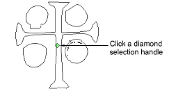
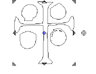
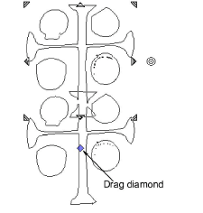
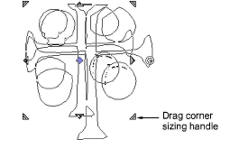
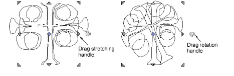
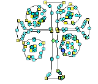

# Reshape carving stamps

|  | Use Reshape > Reshape Object to reshape selected objects by means of control points.                      |
| -------------------------------------------------------- | --------------------------------------------------------------------------------------------------------- |
|      | Use Reshape Views > Show Reshape Nodes to toggle reshape-node display when using the Reshape Object tool. |

Carving stamps can be moved, rotated, scaled, reshaped, and deleted individually in Reshape mode. As you transform carving stamps, needle penetrations in the underlying object are automatically updated.

## To reshape a carving stamp...

- Select an [embroidery object](../../glossary/glossary) in Reshape mode with carving stamps applied. A diamond selection handle is displayed at the center of each stamp.

- Select the diamond selection handle. Another set of sizing, stretching and rotation handles appears.

- Drag the diamond to move the stamp. Holding down the Ctrl key will constrain the movement to the horizontal or vertical axis.

- Drag a corner sizing handle to scale the stamp.

- Hold down the Shift key to scale stamp from the center.
- Hold down the Ctrl key to scale stamp proportionally.
- Hold down both Ctrl and Shift keys while dragging a corner sizing handle to scale stamp proportionally about the center.
- Drag a stretching handle to stretch the stamp. Hold down the Shift key to stretch from the center.

- Drag the rotation handle to rotate the stamp.
- Click the stamp outline to display [control points](../../glossary/glossary). Use these to reshape the stamp.

