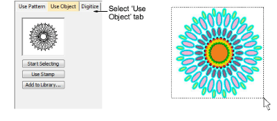
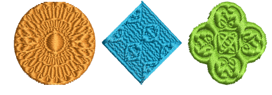
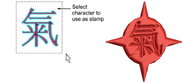

# Use objects as carving stamps

|  | Use Docker > Carving Stamp to define a pattern of needle penetrations using a ‘carving stamp’ as a template. |
| ------------------------------------------------------ | ------------------------------------------------------------------------------------------------------------ |

The Use Object tab allows you to select object outlines from the design window and apply them directly as stamps or save them to a library for future reference. You can use vector or embroidery objects as a basis for stamps.

## To use an object as a carving stamp...

1. Choose an embroidery object or [vector object](../../glossary/glossary#vector-object) to serve as your stamp.

2. Click the Carving Stamp icon and select the Use Object tab.

3. Click the Start Selecting button. Any pre-selected objects remain selected.

4. Hover the mouse over any object in the design window.

5. Click the Use Stamp button to apply the selection as a carving stamp.

6. Optionally, click the Add to Library button to add the selection to the library for future reference.

::: tip
You can also use lettering, embroidery or TrueType, as an input to stamp creation.
:::

::: tip
If you want to use a bitmap image, you can convert to vector format in CorelDRAW Graphics using the Bitmaps > Outline Trace command set.
:::

## Related topics...

- [Add stamps to a library](Add_stamps_to_a_library)
