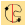
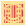
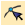
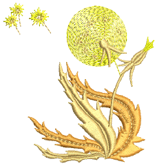
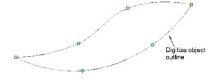
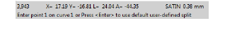
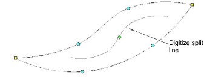
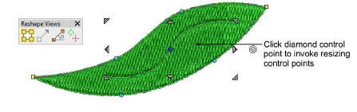
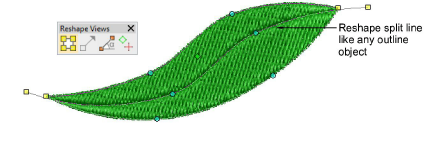
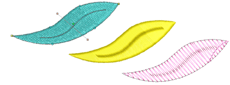

# User-defined splits

|            | Use Traditional Digitizing > Complex Fill to digitize filled shapes with a single stitch angle. Right-click for settings. |
| ---------------------------------------------------- | ------------------------------------------------------------------------------------------------------------------------- |
|  | Use Stitch Effects > User-Defined Split to create your own split line effects. Right-click to adjust settings.            |
|        | Use Reshape > Reshape Object to reshape selected objects, edit stitch angles, and adjust entry/exit points.               |

The User-Defined Split function lets you add detail to filled objects by digitizing lines of needle penetrations called ‘split lines’. Split lines are stored as [object properties](../../glossary/glossary). They are preserved when stitches are regenerated even if you apply a different stitch type.

## To create new objects with user-defined splits...

1Select a fill input method such as Complex Fill and suitable stitch type.

2Click the User-Defined Split icon.

3Digitize the object boundaries, entry and [exit points](../../glossary/glossary) and [stitch angle](../../glossary/glossary) as you normally would, following the prompts in the Prompt Line.

When you have completed the object, you will be prompted to digitize the split line.

4Digitize the split line or press Enter to accept the default. Repeat this step for any additional split lines.

5If you have accepted the default, click Reshape Object. Click the diamond control point in the center of the split line to invoke resizing control points. Use these to resize, rotate, or reposition the split line.

6Alternatively, click the split line at any point. [Control points](../../glossary/glossary) appear together with Reshape Views toolbar. Use these to reshape the split line like any outline object. Note that the split line can extend beyond the object itself.

7Press Esc to complete.

## Tips for use...

- User-defined split can be applied to various stitch types – most commonly tatami, satin, or possibly zigzag.
- If using it with satin, it’s best to turn off auto-split.
- For best results, split lines should be approximately perpendicular to the stitch angle.

## Related topics...

- [Reshaping embroidery objects](../../Modifying/reshape/Reshaping_embroidery_objects)
- [Digitize custom splits](Digitize_custom_splits)
