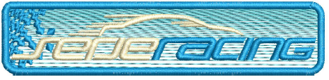
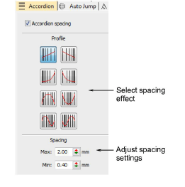
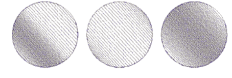
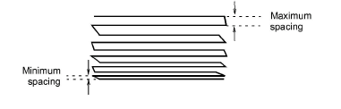
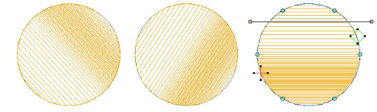

# Accordion spacing

|  | Click Stitch Effects > Accordion Spacing to create perspective and shading effects. Right-click to adjust settings. |
| -------------------------------------------------------------- | ------------------------------------------------------------------------------------------------------------------- |

The Accordion Spacing feature varies stitch spacing between dense and open fill, producing gradient and shading effects which are difficult to achieve manually. It provides a simple way to produce variation in a filled pattern and the illusion of depth. It is best used with tatami fill. When applied, current settings – including [Auto Spacing](../../glossary/glossary) and [Fractional Spacing](../../glossary/glossary) – are ignored. However, other settings still apply, including stitch angle.

## To apply accordion spacing...

- Click the Accordion Spacing icon. The effect is applied to new or selected objects, based on the current Accordion Spacing settings.

Tip: Because of the open stitch, Accordion Spacing is best used without Auto Underlay.

- Right-click the Accordion Spacing icon to access object properties.

- In the Profile panel, select a spacing effect.

- In the Spacing panel, adjust spacing values:

- Use the Reshape tool to adjust the angle of the gradient fill. [See also Adjusting stitch angles.](../../Quality/quality/Adjusting_stitch_angles)

Tip: Apply Trapunto effect to force underlying travel runs to the edges of an object so that they can’t be seen through open stitching. It’s also a good idea to turn off Auto Underlay.

## Related topics...

- [Apply automatic underlay](../../Quality/underlays/Apply_automatic_underlay)
- [Trapunto open stitching](Trapunto_open_stitching)
