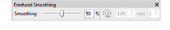
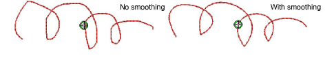
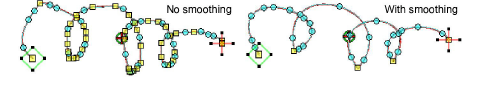
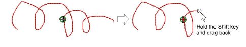

# Adjust freehand line smoothness

|  | Use Graphics Digitizing > Freehand Open Shape to draw ‘freehand’ outlines on screen.         |
| ------------------------------------------------------------------ | -------------------------------------------------------------------------------------------- |
|          | Use Graphics Digitizing > Freehand Closed Shape to draw ‘freehand’ closed objects on screen. |

The Freehand tools have a special cursor. Adjust settings via the Freehand Smoothing toolbar. Also adjust curve ‘smoothing’ as you digitize.

## To adjust freehand line smoothness...

- Create a freehand design using outline and/or filled objects. The Freehand Smoothing toolbar opens.

- Adjust the freehand cursor as required:

| Tool                                                             | Function                                                                                                                          |
| ---------------------------------------------------------------- | --------------------------------------------------------------------------------------------------------------------------------- |
|                            | Use to toggle on/off freehand guide cursor.                                                                                       |
|  | Use to set the size of the inner circle in millimeters.                                                                           |
|      | Use to set the number of circles in the cursor. If the inner circle radius is 2mm, each additional guide circle is offset by 2mm. |

- Adjust freehand line ‘smoothness’ by means of the slider bar. This controls the number of [control points](../../glossary/glossary) generated. Alternatively, adjust smoothing by means of the percentage value.

- View and edit Freehand [control points](../../glossary/glossary) in Reshape mode.

- If you want to erase a portion of a line, press and hold the Shift key while dragging backward over the line before releasing the mouse.

- Alternatively, press the Backspace key. The last point digitized is removed.
- Release the mouse to finish the outline at the last point digitized. Or press Esc to cancel input of the object.

Note: Objects created using the Freehand tools can be reshaped in the same way as objects created via conventional methods.

## Related topics...

- [Create freehand lines](Create_freehand_lines)
- [Reshaping embroidery objects](../../Modifying/reshape/Reshaping_embroidery_objects)
