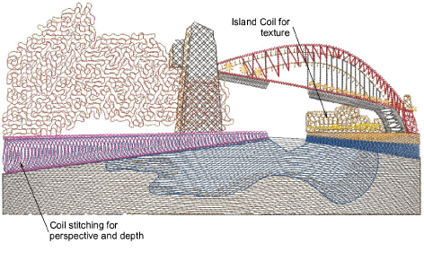

# Chenille patterns

EmbroideryStudio provides a number of stitch patterns traditionally associated with chenille work – Square, Double Square, Coil, and Island Coil. The pattern you use depends on the input tool used as well as object shape, size and the effect you want to achieve.

While these patterns are normally used with chenille designs, they can also be used as decorative lockstitch pattern types. Of course lockstitch machines can’t produce actual chenille chain or moss stitching, except with the aid of a ‘Simple Chenille’ device. However, the patterns themselves can create forms of decorative, open stitching.

## Related topics...

- [Coil stitching](Coil_stitching)
- [Square stitching](Square_stitching)
