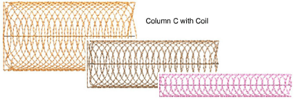

# Coil stitching

Coil stitching is more similar to Satin and is suitable for use with most closed-object input methods. Stitches are generated in spirals.

## Coil stitch

|  | Use Outline Stitch Types > Coil to create borders or columns of even width for an open ‘coil’ effect. Right-click to adjust settings.         |
| -------------------------------------- | --------------------------------------------------------------------------------------------------------------------------------------------- |
|  | Use Fill Stitch Types > Coil to stitch narrow shapes or columns where each stitch traverses the column width. Right-click to adjust settings. |

Coil fill is suited to narrow shapes or columns where each stitch traverses the width of the column. It provides a convenient way to fill an area with open stitching. Stitches are generated along curved lines and coils generate consistent stitch length even over different widths. This produces a smooth finish which does not unravel easily. Coil is generally applied to objects created with Column A, Column B and Column C.

You can adjust Coil settings for stitch length, coil spacing and width.

Column A/B objects can be used with variable width Coil stitching, while complex fill objects will default to Island Coil.

Similarly, Column C objects can be used with variable width stitching.

## Island Coil fill stitch

|  | Use Fill Stitch Types > Island Coil to fill large objects with concentric rows of coil stitching, simulating the circular motion of hand-chenille embroidery. Right-click to adjust settings. |
| ---------------------------------------- | --------------------------------------------------------------------------------------------------------------------------------------------------------------------------------------------- |

Island Coil is used to fill larger closed areas. This technique allows complex shapes to be filled with concentric rows of coil stitching, simulating the circular motion of hand-chenille embroidery. With chenille, this is commonly used with looped Moss stitching. Stitch angles have no effect on this stitch type.

You can adjust a variety of Island Coil settings, including – stitch length, coil width, coil spacing, coil height and coil overlap.

- Juggle spacing and width values for a more or less dense chenille look. Width is set as a percentage of coil spacing value. The smaller the value, the tighter the coils.
- Adjust coil height as preferred. In chenille work, this value affects loop size.
- Adjust coil overlap as preferred. This controls loop spacing and thus fill density.
