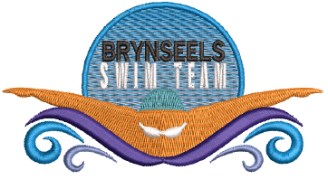
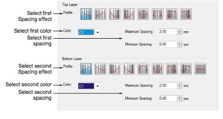
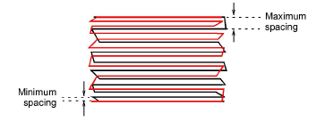
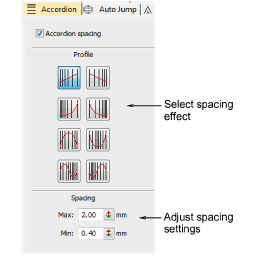
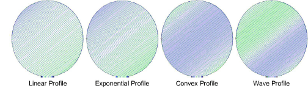

# Color blends

|  | Use Toolbox > Color Blending to generate color blends, perspective effects and shading in selected objects. |
| -------------------------------------------------------- | ----------------------------------------------------------------------------------------------------------- |

From sunsets to wood grains, Color Blending creates interesting color blends. Use it with standard tatami to create depth and shading. Two colors are merged smoothly from one to another using a mixture of dense and open fill.

The effect is generally applied to Complex Fill objects. Curved blends can be created with Column A, B or C objects. Objects can be resized, rotated and skewed without losing the color blending effect. However, editing a color-blended object is limited. The two components must first be ungrouped and separate objects edited according to Accordion Spacing settings such as color, profile, and spacing.

## To create a color blend...

- Select your tatami object and click the Color Blending icon. The Color Blending dialog opens.

- Select complementary profiles for top and bottom layers. Generally you will want to use opposites but you can also mix and match completely different profiles.
- Choose complementary colors for each layer and adjust spacing settings. Generally, you will want to use the same values so that rows blend into one another.

- Click OK to generate.

::: info Note
To prevent underlay stitching from showing through, Auto Underlay is deselected by default and Trapunto effect applied.
:::

## To adjust settings...

- Select the blended object and press Ctrl+U to ungroup.
- Select a component object and change color as required.
- Double-click the object to open Object Properties.
- Click the FX button and select the Accordion tab.

- Select a profile and adjust spacing as preferred.

- Repeat the process for the second object and re-group both.

## Related topics...

- [Stabilizing with automatic underlay](../../Quality/underlays/Stabilizing_with_automatic_underlay)
- [Trapunto open stitching](Trapunto_open_stitching)
- [Accordion spacing](Accordion_spacing)
