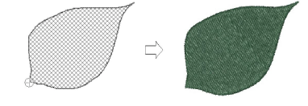

# Create freehand lines

|  | Use Graphics Digitizing > Freehand Open Shape to draw ‘freehand’ outlines on screen.         |
| ------------------------------------------------------------------ | -------------------------------------------------------------------------------------------- |
|          | Use Graphics Digitizing > Freehand Closed Shape to draw ‘freehand’ closed objects on screen. |

Accessed from the Graphics Digitizing toolbar, the freehand feature is deployed in two forms: ‘Open Shape’ and ‘Closed Shape’. As with other digitizing tools, freehand tools can be used in conjunction with all stitch types. With these tools, however, you draw objects directly onscreen. It is thus possible to produce artistic effects similar to free-motion machine embroidery or ‘thread painting’.

::: tip
The Embroidery tools can be operated with a mouse or WACOM pen.
:::

## To create freehand lines...

- When digitizing with the Freehand tools, the Auto Scroll option needs to be turned off. Use the Ctrl+Shift+A key combination to toggle on/off.
- Create open outlines with the Freehand Open Shape tool. Select any outline stitch and click and drag to draw. Release to finish.
- Try creating embroidered calligraphy by combining the Freehand Open Shape tool with Column C angle and orientation controls.

- To create closed outlines, use the Freehand Closed Shape tool in conjunction with an outline stitch.

- To create closed fills, use the Freehand Closed Shape tool in conjunction with a fill stitch.

- If you want to close an open object, use the Edit > Close Curve with... command with the option of using straight or curved points.

## Related topics...

- [Scroll options](../../Setup/settings/Scroll_options)
- [Set angles & orientation](../../Digitizing/input/Set_angles_orientation)
