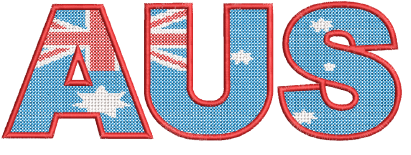
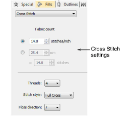
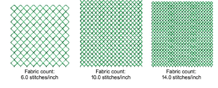
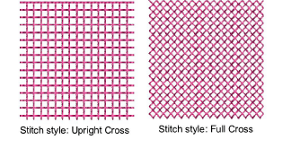

# Cross stitch fills

|  | Use Fill Stitch Types > Cross Stitch to fill large areas with cross stitching on an invisible grid that applies to all design objects. |
| ------------------------------------------------------------ | -------------------------------------------------------------------------------------------------------------------------------------- |

Cross stitching is a popular technique for filling large areas with low stitch counts. Cross stitch is also sometimes combined with appliqué. Cross Stitch fill is something like Motif Fill but is generated differently.

Crosses in different objects align when using the same fabric count. This is because cross stitch fills are generated on an invisible grid, not referenced to the individual object. Fractional crosses are generated at object boundaries in order to avoid gaps forming. Cross Stitch fill uses travel runs under and along the cross stitching.

Note: Cross Stitch fill is a stitch type in its own right but does not replace the ES Cross Stitch application available via the File menu. See also EmbroideryStudio Cross Stitch Supplement.

## To create a cross stitch fill...

- Create or select a closed-object and click the Cross Stitch icon.

Current Cross Stitch settings are applied. Auto Underlay and Pull Compensation are automatically deactivated. Stitch angle has no effect on the pattern layout.

- To change settings, double-click or right-click the object/s to access object properties.

- Adjust Fabric Count settings to match the fabric size you are working with.

- Choose a stitch style.

- Adjust other cross stitch settings as desired:

| Option          | Function                                                                                                                                     |
| --------------- | -------------------------------------------------------------------------------------------------------------------------------------------- |
| Fabric count    | Controls the size of cross specified as a counted fabric rather than an actual cross size.                                                   |
| Threads         | Sets thread count – e.g. 2, 4 or 6 – which determined number of times thread passes over the same cross in order to make it bulkier.         |
| Stitch style    | Full cross (X), diagonal (\\), or upright (+).                                                                                               |
| Floss direction | Controls direction of top leg of the cross – forward or backward for diagonal full crosses, horizontal or vertical for upright full crosses. |

Tip: The cross stitch grid is not displayed but you can set the background grid to the cross size to get a better idea. Use Snap to Grid to ensure that your object outlines line up with the cross stitch grid.

## Related topics...

- [Motif fills](../motifs/Motif_fills)
- [Embroidery digitizing](../../Digitizing/input/Embroidery_digitizing)
- [Grid display options](../../Setup/settings/Grid_display_options)
