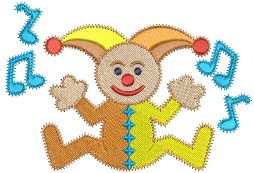
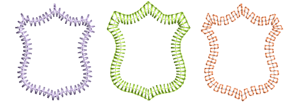
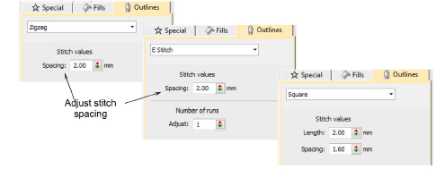
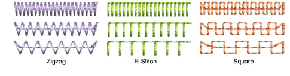
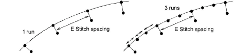

# Decorative borders

|    | Click Outline Stitch Types > Zigzag to create open borders or columns of even width for an open ‘sawtooth’ effect. Right-click for settings. |
| ------------------------------------------------ | -------------------------------------------------------------------------------------------------------------------------------------------- |
|  | Use Outline Stitch Types > E Stitch to create open borders or columns of even width for an open ‘comb’ effect. Right-click for settings.     |
|                  | Use Outline Stitch Types > Square to create open borders or columns of even width for an open ‘toothed’ effect. Right-click for settings.    |

The Stitch Types toolbars include Zigzag, E Stitch, and Square. All can be used to create borders around [appliqués](../../glossary/glossary) and other embroidery objects. They can also be used for decorative effects or open fills where fewer stitches are required. Zigzag and double zigzag stitches are also frequently used as underlays.

## To create decorative borders...

- Select the digitizing method you want to use – open or closed.
- Select an outline or fill stitch type and create the [embroidery object](../../glossary/glossary). Alternatively, select an existing object and apply a stitch type.

- Double-click the object or right-click the icon to access object properties. These give you control over stitch spacing, length, and run count values.

- Adjust Spacing for more or less dense outlines.

- Create parallel stitching and control the angle relative to the horizontal. Use it to create calligraphy-like stitching.

- E Stitch also lets you set the number of runs:

## Related topics...

- [Chenille patterns](Chenille_patterns)
- [Zigzag underlay settings](../../Quality/underlays/Zigzag_underlay_settings)
- [Embroidery digitizing](../../Digitizing/input/Embroidery_digitizing)
- [Digitizing regular columns](../../Digitizing/input/Digitizing_regular_columns)
- [Trapunto open stitching](Trapunto_open_stitching)
- [Appliqué Embroidery](../../Applied/applique/Appliqué_Embroidery)
