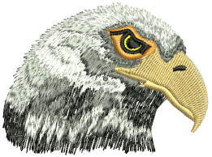

# Freehand embroidery

The Freehand feature provides functionality similar to CorelDRAW® Graphics Suite Freehand and Polyline tools. Freehand has many benefits. It lets you create designs with a hand-drawn appearance, something which is difficult to achieve through conventional digitizing methods. The aim is to mimic the fluid and free-flowing effects formed by means of freehand stitching techniques.

## Related topics...

- [Freehand stitching techniques](Freehand_stitching_techniques)
- [Create freehand lines](Create_freehand_lines)
- [Adjust freehand line smoothness](Adjust_freehand_line_smoothness)
