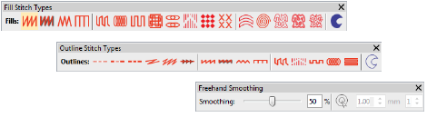

# Freehand stitching techniques

|  | Use Graphics Digitizing > Freehand Open Shape to draw ‘freehand’ outlines on screen.         |
| ------------------------------------------------------------------ | -------------------------------------------------------------------------------------------- |
|                    | Use Graphics Digitizing > Freehand Closed Shape to draw ‘freehand’ closed objects on screen. |

Any of the outline stitch types can be used with Freehand open and closed curves. When Open Shape is selected, the Stitch Types toolbars offer a choice of Run, Triple Run, and other outline stitch types. When the Closed Shape tool is selected, the toolbar offers the full range of stitch types, both outline and fill. In addition, an ancillary Freehand Smoothing toolbar gives you control over freehand lines.

The possibilities offered by these options for creative, artistic expression are limitless. Especially when used with stylus pen tablets. Techniques include stitching on top of photographic images or detailed line drawings.

Alternatively, designs resembling pencil or charcoal sketches can be digitized. Use the tools to create ‘doodle’ type drawing effects without following detailed artwork – for example, adding to a basic clipart design or decorative text and so on.

## Related topics...

- [Set angles & orientation](../../Digitizing/input/Set_angles_orientation)
