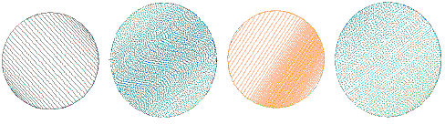

# Gradient stitching

EmbroideryStudio provides tools for varying stitch spacing between dense and open fill, producing gradient and shading effects which are difficult to achieve manually. Create color blends where two colors are merged from one to another using a mixture of dense and open fill.

## Related topics...

- [Accordion spacing](Accordion_spacing)
- [Color blends](Color_blends)
