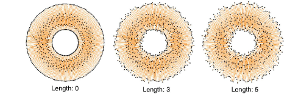

# Hand stitch effect

|  | Use Stitch Effects > Hand Stitch to create hand-stitch effects which combine randomized stitch length, angle and count. Can be applied to satin, tatami, run, backstitch, and other stitch types. |
| -------------------------------------------------------------- | ------------------------------------------------------------------------------------------------------------------------------------------------------------------------------------------------- |

Fashion trends sometimes favor a more organic look which is very hard to achieve with normal design tools. With Hand Stitch, you can create effects which combine randomized stitch length, angle and count.

## To apply hand stitch effect...

1Choose the object you want to apply the effect to or toggle on Hand Stitch effect before you start digitizing. It can be applied to satin, tatami, run, backstitch, and other stitch types.

2Click the Hand Stitch icon. The effect is applied based on current settings.

3Right-click the Hand Stitch icon to access object properties.

4Adjust stitch roughness settings to diminish or exaggerate the effect:

- In the Length field, enter a value between 0 and 5 to set stitch-length variation. ‘0’ indicates that no change is applied to current stitch settings.

- In the Angle field, enter a value between 0 and 5 to set stitch-angle variation.

5Adjust stitch mass settings to diminish or exaggerate stitch mass:

- In the Count field, select a multiplication factor to increase hand-stitch density.

- In the Random field, select a value between 1 and 5 to set a random factor for the stitch count. The system randomly adds or sometimes removes stitches when Count > 1x, usually resulting in increased stitch mass. (When count is 1x, no stitches are removed but some are added.)

6Optionally, in the Variant field, enter a value between 1 and 10 to experiment with variants of the same roughness and mass settings.

Tip: Make any further adjustments necessary to the underlying stitch type. For instance, when using Satin stitch, you may want to increase stitch spacing as well as use a lighter underlay.

## Tips for use...

- For hand-stitching, embroiderers tend to use ‘long & short’ satin stitching or contoured runs to fill a large area. This is the effect we are aiming for.
- When used with satin stitching, Hand Stitch effect works best with Auto Split turned off. However, when used with higher stitch roughness ‘length’ settings, jump stitches are sometimes generated as this setting affects stitch length.
- For smaller objects, turn off underlay.
- More stitch spacing is needed for higher stitch counts to avoid stitch bunching.
- Tatami fill is not so well suited for use with Hand Stitch effect. If you want to use it, try using a random factor to eliminate split-line patterns.

## Related topics...

- [Stitch Types](../../Digitizing/stitches/Stitch_Types)
- [Digitizing Shapes](../../Digitizing/input/Digitizing_Shapes)
- [Satin stitching](../../Digitizing/stitches/Satin_stitching)
- [Stabilizing with automatic underlay](../../Quality/underlays/Stabilizing_with_automatic_underlay)
- [Create random patterns](../patterns/Create_random_patterns)
