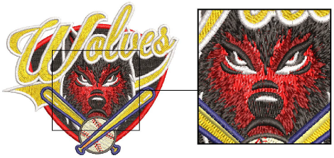
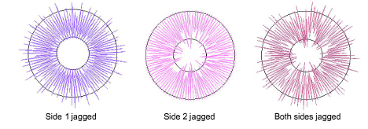
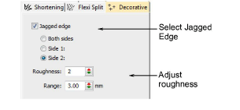
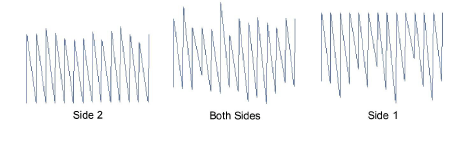
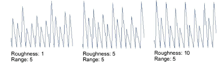
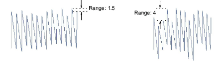

# Jagged edges

|  | Use Stitch Effects > Jagged Edge to create rough edges, shading effects, or imitate fur and other fluffy textures along one or more sides of selected objects. |
| -------------------------------------------------- | -------------------------------------------------------------------------------------------------------------------------------------------------------------- |

Use Jagged Edge to create rough edges, shading effects, or imitate fur and other fluffy textures.

## To create jagged edges...

- Choose the object you want to apply the effect to or toggle on before you start digitizing. It can be applied to satin or tatami fills with or without program splits. It doesn’t work with Contour stitch.
- Click the Jagged Edge icon. The effect is applied based on current Jagged Edge and stitch settings.

Tip: For objects filled with tatami, use diagonal backstitch for best results.

- Right-click the Jagged Edge icon to access object properties.

- Select a side – Side 1, Side 2, or Both Sides.

- In the Roughness field, enter a value between 1 and 10 to set the degree of jaggedness.

- In the Range field, enter the margin within which you want stitches to fall.

## Related topics...

- [Other tatami settings](../../Digitizing/stitches/Other_tatami_settings)
