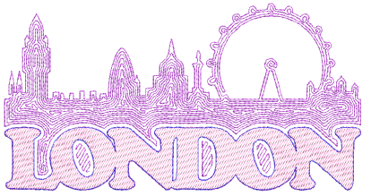
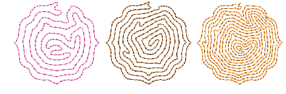
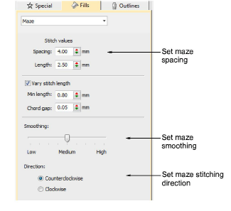
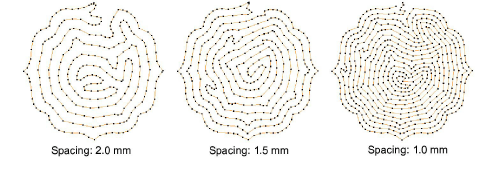
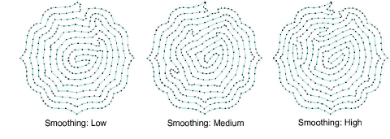
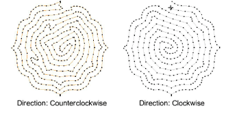
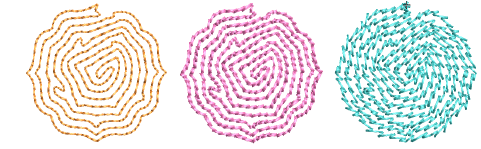

# Maze fills

|  | Use Fill Stitch Types > Maze Fill to create maze-like stitching which follows object contours for open fills. Right-click for settings. |
| ---------------------------------------------- | --------------------------------------------------------------------------------------------------------------------------------------- |

Automatically fill large areas with double-spiral stitching that never crosses itself with Maze Fill.

## To create a maze fill...

- Choose the object you want to apply the stitch to or toggle on before you start digitizing. Stitch angles have no effect on this stitch type.
- Click the Maze Fill icon. The result is based on current settings.

- Right-click the Maze Fill icon to access object properties.

- To set a nominal stitch length, adjust the Length field. To automatically shorten stitches to follow tight curves, activate the Variable Run Length option. Because this fill type creates double-spiral stitching, these settings are essentially the same as Run stitch.
- Adjust Spacing to create more or less open stitching.

- Adjust Smoothing for more or less even curves.

- Adjust Direction to reverse stitch direction.

Tip: Maze Fill uses single run stitch for the fill. If you want a thicker stitch type, use Break Apart to turn the object into an outline and then apply a different stitch type.

## Related topics...

- [Digitizing outlines & details](../../Digitizing/input/Digitizing_outlines_details)
- [Offset fills](../curves/Offset_fills)
