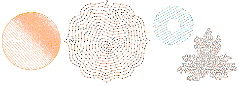

# Open stitching

EmbroideryStudio provides various stitch types and effects to create open stitching. These can be used to provide interesting textures and low stitch counts for larger embroidered areas.

## Related topics...

- [Decorative borders](Decorative_borders)
- [Stippling effects](Stippling_effects)
- [Maze fills](Maze_fills)
- [Trapunto open stitching](Trapunto_open_stitching)
