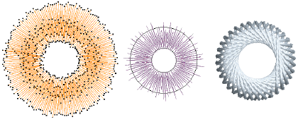

# Organic stitching

EmbroideryStudio provides tools for creating more natural, ‘organic’ stitching styles with the Hand Stitch and Jagged Edge effects. These can be applied to satin, tatami, run, backstitch, and other stitch types, to imitate hand stitching as well as imitate fur and other fluffy textures. String stitch type is ideally suited to creating craftstitch fills as well as delicate borders.

## Related topics...

- [Hand stitch effect](Hand_stitch_effect)
- [Jagged edges](Jagged_edges)
- [String stitching](String_stitching)
