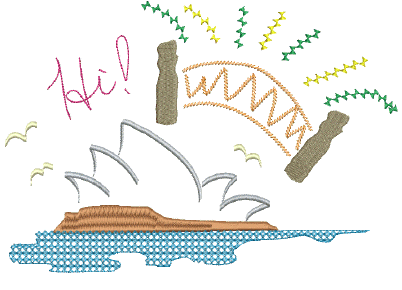

# Specialty Stitching

EmbroideryStudio provides many specialty effects and stitch types to create artistic fills. These can be used to create more organic, naturalistic stitching. They can be used to create textures like feathers or wool. Use them to create open stitching with low stitch counts.

Specialty stitch effects covered in this section include:

| Feature                                                  | Overview          |                                                                                                                               |
| -------------------------------------------------------- | ----------------- | ----------------------------------------------------------------------------------------------------------------------------- |
|  | Freehand          | Create designs with a hand-drawn appearance, something which is difficult to achieve through conventional digitizing methods. |
|      | Hand Stitch       | Create hand-stitch effects which combine randomized stitch length, angle and count.                                           |
|                  | Jagged Edge       | Create rough edges, shading effects, or imitate fur and other fluffy textures.                                                |
|                | Stipple           | Create textured fills of run stitching which meanders more or less randomly within a border.                                  |
|                      | Maze Fill         | Create maze-like stitching which follows object contours for open fills.                                                      |
|                          | String            | Create craftstitch fills as well as delicate borders. Can be used as a border for fixing ornamental mirrors and sequins.      |
|                  | Zigzag            | Create fills or open borders or columns of even width for an open ‘sawtooth’ effect.                                          |
|                        | E Stitch          | Create fills or open borders or columns of even width for an open ‘comb’ effect.                                              |
|                      | Trapunto          | Move internal travel runs to the edges of an object so that they can’t be seen through open stitching.                        |
|      | Accordion Spacing | Vary stitch spacing between dense and open fill, producing gradient and shading effects.                                      |
|            | Color Blending    | Create color blends where two colors are merged from one to another using a mixture of dense and open fill.                   |
|                              | Chenille          | Utilize stitch patterns traditionally associated with chenille work – Square, Double Square, Coil, and Island Coil.           |
|        | Cross Stitch      | Fill large areas with cross stitching on an invisible grid that applies to all design objects.                                |

## Related topics...

- [Freehand embroidery](Freehand_embroidery)
- [Organic stitching](Organic_stitching)
- [Open stitching](Open_stitching)
- [Gradient stitching](Gradient_stitching)
- [Chenille patterns](Chenille_patterns)
- [Cross stitch fills](Cross_stitch_fills)
