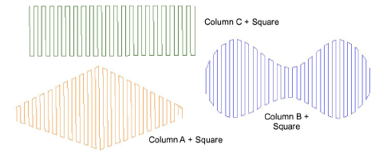
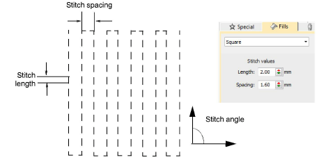
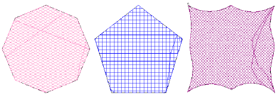
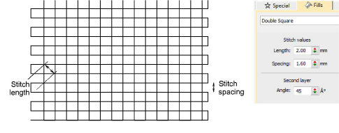

# Square stitching

Square stitching is closer to Tatami and is suitable for use with most closed-object input methods. It can be used for borders like Zigzag and E Stitch, or it can be used as a substitute for Tatami in more open fills. Double Square is commonly used in chenille work with Moss stitching. It is suitable for larger areas.

## Square stitch

|  | Use Outline Stitch Types > Square to create open borders or columns of even width for an open ‘toothed’ effect. Right-click for settings. |
| ------------------------------------------ | ----------------------------------------------------------------------------------------------------------------------------------------- |
|  | Use Fill Stitch Types > Square to create open straight parallel fills. Right-click for settings.                                          |

Square is suitable for narrow objects digitized with most closed-object input methods. You can fill areas diagonally, or on the horizontal and vertical. All stitches generated along a row are of same length. However, some shorter stitches are generated where the shape is narrow and between rows of stitching. You could obtain a similar effect using open tatami with borderline backstitch, but Square stitch makes it simpler to achieve. Use it to create a ‘chenille look’ using cord and adjusting the presser foot height to create loops.

You can set the Square stitch values for stitch length and spacing.

Tip: Limit travel runs showing through the stitching by changing entry and exit points to reduce segmentation within the shape.

## Double Square stitch

|  | Use Fill Stitch Types > Double Square to create grid fills. Apply closed shapes. Right-click for settings. |
| -------------------------------------------- | ---------------------------------------------------------------------------------------------------------- |

As an alternative to Island Coil, larger areas can be filled using Double Square. It is made up of two layers of Square stitching. With chenille work, this too is suitable for use with looped Moss stitching.

You can adjust stitch length, spacing, and the angle of the second Double Square layer. Spacing determines the space between stitch lines. Stitch length is the gap between needle points.

The angle of the first layer is defined by Complex Fill object properties. The Double Square properties give you the angle of the second layer in relation to the first – default, 90°. Thus, if the first is 30°, the second will be 120°.

Tip: Like Square stitch, you can use Double Square to create a ‘chenille look’ using cord and adjusting the presser foot height to create loops. Double square creates a denser fill.
