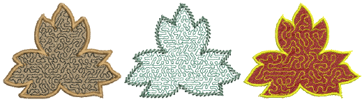
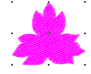
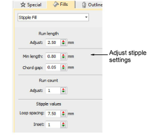
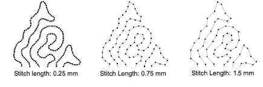
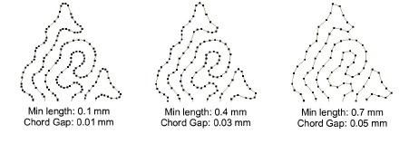
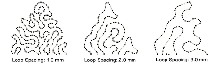
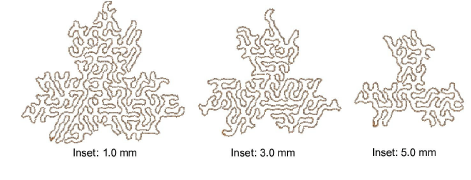
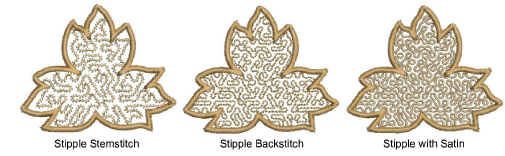

# Stippling effects

|            | Use Fill Stitch Types > Stipple Fill to create stippled fills of run stitching which meanders more or less randomly within a border. Right-click for settings. |
| -------------------------------------------------------------- | -------------------------------------------------------------------------------------------------------------------------------------------------------------- |
|  | Use Fill Stitch Types > Stipple Backstitch to create a backstitch fill which meanders randomly within a border. Right-click for settings.                      |
|  | Use Fill Stitch Types > Stipple Stemstitch to create a stemstitch fill which meanders randomly within a border. Right-click for settings.                      |

Stippling is a method for creating textured fills of run stitching which meanders more or less randomly within a border. It can be applied to any closed objects. Stitch angle has no effect.

## To create a stippling fill...

- Choose the object you want to apply the stitch type to or toggle on before you start digitizing. It can be applied to any closed object.

- Click the Stipple Fill icon. Stipple fill is applied and the Object Properties docker opens.

- Adjust Run Length as required.

- Adjust Min Length (minimum stitch length) and Chord Gap as required.

- Adjust Run Count setting for a thicker line.
- Adjust Loop Spacing as required.

- Set a margin from the object outline by adjusting the Inset value.

- Use Stipple Stemstitch and Stipple Backstitch as preferred.

## Related topics...

- [Break apart composite objects](../../Modifying/reshape/Break_apart_composite_objects)
