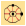
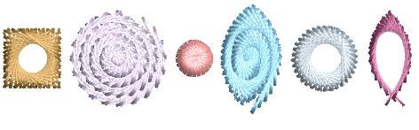
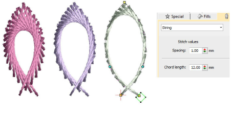
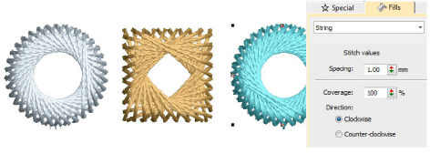
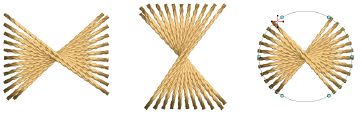

# String stitching

|  | Use Fill Stitch Types > String to create string craftstitch fills. Apply to closed shapes.                                    |
| ------------------------------------------ | ----------------------------------------------------------------------------------------------------------------------------- |
|  | Use Outline Stitch Types > String to create string craftstitch outlines for delicate borders. Apply to open or closed shapes. |
|        | Use Traditional Digitizing > Digitize Run to create row of single stitches along a digitized line.                            |
|  | Use Traditional Digitizing > Complex Fill to digitize filled shapes with a single stitch angle. Right-click for settings.     |
|                | Use Traditional Digitizing > Ring to digitize circle and oval-shaped rings.                                                   |

String Stitch has its origins in India where it is known as ‘Paghadi’. This is commonly used to hold down small mirrors in intricate fabric designs. String Stitch mimics the overlapping ‘string art’ of Paghadi stitching. It too can be used to secure mirrors or sequins. Or it can be used for decorative effects such filling leaf-like shapes with elongated stitching. It comes in two forms – outlines and fills – and can be applied to open or closed shapes.

Most String stitch effects can be achieved by quite simple means. Since stitch angles have no effect, you can digitize most shapes with simple tools such as Run or Complex Fill. String outline provides spacing and chord length settings for control of outline density and thickness. Reversing entry and exit points will also affect the direction of stitch overlaps.

String fill provides a spacing setting for control of stitch density. Thickness is determined by the shape. Try using it with both closed objects and objects with holes such as Ring objects. Direction of stitch overlaps is controlled by the Direction setting.

The Coverage setting can be used create partial covers such as the ones below. Control orientation either via the Direction setting or by changing entry/exit points.

## Related topics...

- [Digitizing outlines & details](../../Digitizing/input/Digitizing_outlines_details)
- [Creating free-form shapes](../../Digitizing/input/Creating_free-form_shapes)
- [Digitize stars & rings](../../Modifying/productivity/Digitize_stars_rings)
