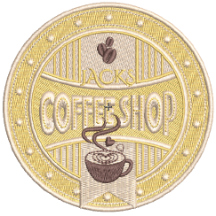

# Embroidery Digitizing

In EmbroideryStudio, you build designs from basic shapes or ‘[embroidery objects](../../glossary/glossary#embroidery-objects)’. These are like ordinary [vector objects](../../glossary/glossary) in that they have certain defining characteristics or ‘[properties](../../glossary/glossary#properties)’ such as color, size, position, and so on. They also have properties unique to embroidery such as stitch type and density.

## Stitch types

This section explains how to select stitch types for your various fills, including how to create Satin fills, Tatami, Motif, and Contour fills, and how to adjust stitch settings for best results. It also describes how to create Zigzag and E Stitch fills and borders. [See Stitch Types for details.](../stitches/Stitch_Types)

## Digitizing shapes

This section discusses the automatic conversion of vector to embroidery objects. It also deals with manual digitizing methods, including digitizing free shapes, simple borders, and complex column shapes. [See Digitizing Shapes for details.](../input/Digitizing_Shapes)

## Object properties

This section explains how to change property settings in a design, as well as how to apply and adjust fabric settings. It also explains how to create and maintain styles and templates in EmbroideryStudio. [See Object Properties for details.](../properties/Object_Properties)

## Colorways

When digitizing, you select colors from the [color palette](../../glossary/glossary#color-palette). This contains a selection of colors which can be tailored to each design or color scheme. The particular ‘[colorway](../../glossary/glossary)’ represents the actual thread colors in which a design will be stitched. You can define multiple color schemes and switch between them. [See Colorways for details.](../colorways/Colorways)
